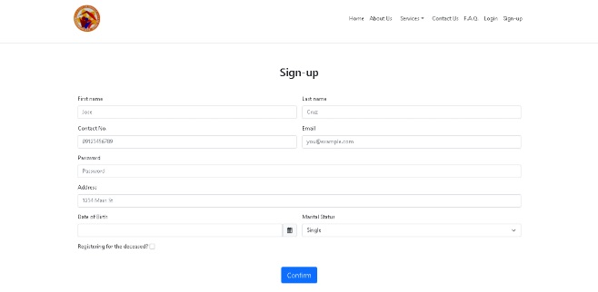
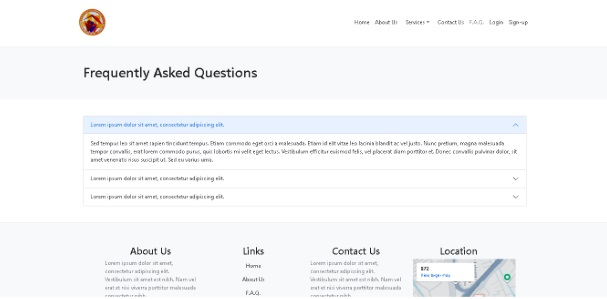
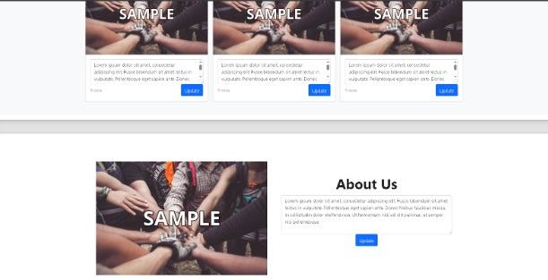

rehosted groupwork

Brgy872, Pandacan Information System Website (Group Work)

May, 2023

Github: https://github.com/GECadiao/IT135_PHP_Project

Backend: PHP

Frontend: HTML & CSS

Database: MySQL

Server: Apache

Description: Barangay Hub for resident’s easy access to barangay resource.

My contributions:

In this project, I was responsible for bridging a static front-end to our database using PHP. My contributions include:

-Integrated server-side PHP logic to the provided pre-designed frontend by my groupmates to create a functional barangay portal,

-Used an OOP-based authentication system with PHP sessions to handle logins and role-based access for users and admins,

-Built a back-end logic layer that allows admins to update the homepage content through an administrative dashboard, and

-Applied BCRYPT hashing for passwords and used prepared statements.

## 📸 Screenshots
| Feature | Preview |
|------|------|
| Sign-up |  |
| FAQ |  |
| Dashboard |  |
